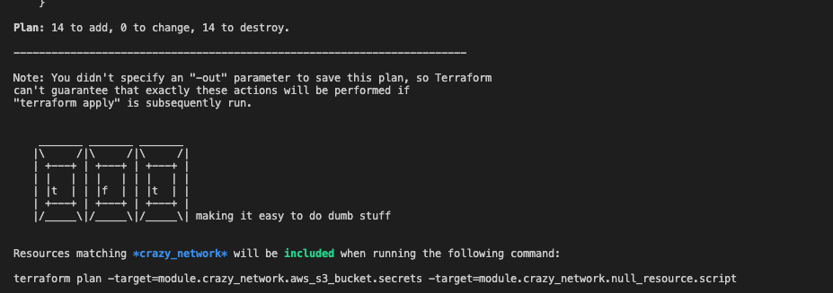

# tft
[](https://travis-ci.org/phzietsman/tft)

terraform targeted applies made easy, aka making it easy to do dumb stuff.



using globs in `-target` is an open issue on [terraform](https://github.com/hashicorp/terraform/issues/2182) and it is not getting a ton of love (probably because it promotes bad behaviour), but sometimes i need to be bad. 

## why i need this
i work accross many teams and 100s of terraform state files. most teams only have access to terraform oss and occationally we run into issues where you have to do a targeted apply or patch spesific resource type accross the entire estate without affecting other resources, think of updating all your bucket policies to include a new whitelisted ip address. we've solved this problem to a large extend using branching strategies, but even then you need a terraform targeted apply now and again. in these scenarions you would want something like 
```sh
$ terraform apply -target=*aws_s3_bucket_policy*

# OR

$ terrform apply -not-target=*aws_s3_bucket_policy*

```

this is where i use `tft`, by piping your plan through it you will get the `-target=` arguments needed to achieve either an **include** or **exclude**.

## getting started

### installation

under releases you can download the built binaries or install it using go :  

```sh
$ go get  github.com/phzietsman/tft 
```

### running the thing

terraform will manage the dependencies and figure out what needs to be applied with your targeted resources. this makes exludes now absolute since some of the resources you are including might have a dependency on an excluded resources.   

**ALWAYS INSPECT YOUR PLAN BEFORE APPLYING**

to match resources you can use **globs**.

```sh 

# This will include all aws_s3_bucket_policy resources
$ terraform plan | tft -pattern="*aws_s3_bucket_policy*" -mode=include

# This will include all aws_s3_bucket_policy resources in module something
$ terraform plan | tft -pattern="module.something.aws_s3_bucket_policy*" -mode=include

# This will include all aws_s3_bucket_policy resources in all modules
$ terraform plan | tft -pattern="module.*.aws_s3_bucket_policy*" -mode=include

# This will exclude all aws_s3_bucket_policy resources
$ terraform plan | tft -pattern="*aws_s3_bucket_policy*" -mode=exclude

```

## things i'll add (maybe)

since i have little to no go knowledge and its only me using this and it is serving its purpose well, i'm not in a hurry to change things, but i'd still like to keep it alive. This is what i'm planning:

- i want to use some cool cli framework. cause. this looks like a good one: https://github.com/urfave/cli
- ~~get a handle on the terraform commands and args. then i could run the targeted plan for you and create a better output.~~ this is impossible.
- fix the typos in this doc and use caps.
- add some tests and error handling. this seems to be the responsible thing to do.
- package this for brew
 


